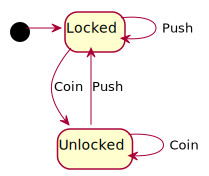

# Hana State Machine (HSM)
[](https://travis-ci.org/erikzenker/hsm)
=

The hana state machine (hsm) is a [finite state machine](https://en.wikipedia.org/wiki/Finite-state_machine) library based on the [boost hana](https://www.boost.org/doc/libs/1_61_0/libs/hana/doc/html/index.html) meta programming library. It follows the principles of the [boost msm](https://www.boost.org/doc/libs/1_64_0/libs/msm/doc/HTML/index.html) and [boost sml](https://boost-experimental.github.io/sml/index.html) libraries, but tries to reduce own complex meta programming code to a minimum. The library is in an very early developement phase.

Currently the following features are supported:
* Initial pseudo state
* External transitions with guards and actions
* [Anonymous transitions](test/integration/anonymous_transition.cpp)
* Submachines
* [Pseudo entry/exit states](test/integration/entry_exit_pseudo_states.cpp)
* [Entry/exit state behavior](test/integration/entry_exit_actions.cpp)
* [Direct transitions](test/integration/direct_transitions.cpp)

What is missing:
* Orthogonal regions
* Explixit terminate state
* Internal transitions
* Fork Entry
* History

## Simple Example ([Turnstile](example/turnstile/main.cpp))


```c++
#include "hsm/hsm.h"

#include <cassert>

// States
struct Locked {
};
struct Unlocked {
};

// Events
struct Push {
};
struct Coin {
};

// No events nor guards in this example
const auto none = []() {};

struct Turnstile {
    constexpr auto make_transition_table()
    {
        // clang-format off
        return hsm::transition_table(
            //              Start      , Event              , Guard   , Action , Target
            //             +-----------+--------------------+---------+--------+---------------+
            hsm::transition(Locked {}  , hsm::event<Push> {}, none    , none   , Locked {}    ),
            hsm::transition(Locked {}  , hsm::event<Coin> {}, none    , none   , Unlocked {}  ),
            //            +------------+--------------------+---------+--------+---------------+
            hsm::transition(Unlocked {}, hsm::event<Push> {}, none    , none   , Locked {}    ),
            hsm::transition(Unlocked {}, hsm::event<Coin> {}, none    , none   , Unlocked {} ));
            //            +------------+--------------------+-------+----------+---------------+
        // clang-format on
    }

    constexpr auto initial_state()
    {
        return Locked {};
    }
};

int main()
{
    hsm::Sm<Turnstile> turnstileSm;

    // The turnstile is initially locked
    assert(turnstileSm.is(Locked {}));

    // Inserting a coin unlocks it
    turnstileSm.process_event(Coin {});
    assert(turnstileSm.is(Unlocked {}));

    // Entering the turnstile will lock it again
    turnstileSm.process_event(Push {});
    assert(turnstileSm.is(Locked {}));

    return 0;
}
```

## Complex Example ([Cd player](example/cdplayer/main.cpp))

```c++
#include "hsm/hsm.h"

#include <cassert>

// States
struct Empty {
};
struct Open {
};
struct Stopped {
};
struct Paused {
};
struct Song1{
};
struct Song2{
};
struct Song3{
};

// Events
struct cd_detected {
};
struct open_close {
};
struct stop {
};
struct play {
};
struct pause {
};
struct end_pause {
};
struct next_song {
};
struct prev_song {
};

// Actions
const auto store_cd_info = []() {};
const auto open_drawer = []() {};
const auto close_drawer = []() {};
const auto stopped_again = []() {};
const auto start_playback = []() {};
const auto stop_and_open = []() {};
const auto pause_playback = []() {};
const auto stop_playback = []() {};
const auto resume_playback = []() {};
const auto start_next_song = [](){};
const auto start_prev_song = [](){};

// Guards
const auto none = [](){};


struct Playing {
    constexpr auto make_transition_table()
    {
        // clang-format off
        return hsm::transition_table(
            //              Start      , Event                    , Guard   , Action            , Target
            //             +-----------+--------------------------+---------+-------------------+---------------+
            hsm::transition(Song1 {}   , hsm::event<next_song> {} , none    , start_next_song   , Song2 {}      ),
            //            +------------+--------------------------+---------+-------------------+---------------+
            hsm::transition(Song2 {}   , hsm::event<prev_song> {} , none    , start_prev_song   , Song1 {}      ),            
            hsm::transition(Song2 {}   , hsm::event<next_song> {} , none    , start_next_song   , Song3 {}      ),                        
            //            +------------+--------------------------+---------+-------------------+---------------+
            hsm::transition(Song3 {}   , hsm::event<prev_song> {} , none    , start_prev_song   , Song2 {}     ));
            //            +------------+--------------------------+---------+-------------------+---------------+            
        // clang-format on
    }

    constexpr auto initial_state()
    {
        return Song1 {};
    }
};


struct CdPlayer {
    constexpr auto make_transition_table()
    {
        // clang-format off
        return hsm::transition_table(
            //              Start       , Event                      , Guard   , Action           , Target
            //             +------------+----------------------------+---------+------------------+---------------+
            hsm::transition(Empty {}    , hsm::event<cd_detected> {} , none    , store_cd_info    , Stopped {}    ),
            hsm::transition(Empty {}    , hsm::event<open_close> {}  , none    , open_drawer      , Open {}       ),            
            //            +-------------+----------------------------+---------+------------------+---------------+
            hsm::transition(Open {}     , hsm::event<open_close> {}  , none    , close_drawer     , Empty {}      ),            
            //            +-------------+----------------------------+---------+------------------+---------------+
            hsm::transition(Stopped {}  , hsm::event<open_close> {}  , none    , open_drawer      , Open {}       ),
            hsm::transition(Stopped {}  , hsm::event<stop> {}        , none    , stopped_again    , Stopped {}    ),
            hsm::transition(Stopped {}  , hsm::event<play> {}        , none    , start_playback   , Playing {}    ),
            //            +-------------+----------------------------+---------+------------------+---------------+            
            hsm::transition(Playing {}  , hsm::event<open_close> {}  , none    , stop_and_open    , Open {}       ),            
            hsm::transition(Playing {}  , hsm::event<pause> {}       , none    , pause_playback   , Paused {}     ),                        
            hsm::transition(Playing {}  , hsm::event<stop> {}        , none    , stop_playback    , Stopped {}    ),                                    
            //            +-------------+----------------------------+---------+------------------+---------------+                        
            hsm::transition(Paused {}   , hsm::event<end_pause> {}   , none    , resume_playback  , Playing {}    ),                                                
            hsm::transition(Paused {}   , hsm::event<stop> {}        , none    , stop_playback    , Stopped {}    ),                                                            
            hsm::transition(Paused {}   , hsm::event<open_close> {}  , none    , stop_and_open    , Open {}      ));                                                                      
            //            +-------------+----------------------------+---------+------------------+---------------+                                    
        // clang-format on
    }

    constexpr auto initial_state()
    {
        return Empty {};
    }
};

int main()
{
    hsm::Sm<CdPlayer> CdPlayerSm;

    // Cd player is empty
    assert(CdPlayerSm.is(Empty {}));

    return 0;
}

```

## Create and Install the Package
``` bash
mkdir src/build
cd src/build
cmake .. -DCMAKE_BUILD_TYPE=Release -DCMAKE_INSTALL_PREFIX=/tmp/
cmake --build . --target install
```

## Compile and Run the Tests Using the Installed Library
``` bash
mkdir test/build/
cd test/build/
cmake .. -DCMAkE_BUILD_TYPE=Release -DCMAKE_INSTALL_PREFIX=/tmp/
cmake --build . --target hsmTests
ctest -VV
```

## Author
* erikzenker(at)hotmail.com
